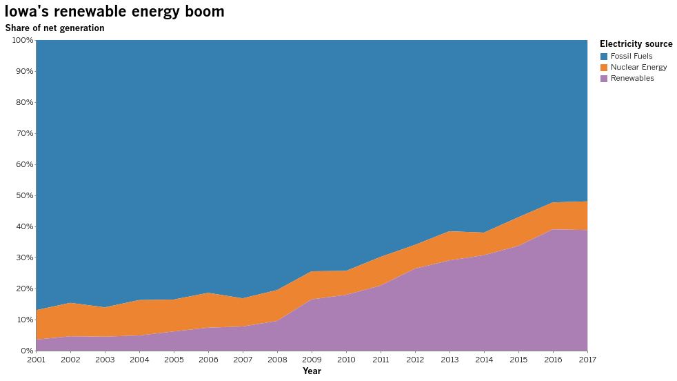

# altair-latimes

A Los Angeles Times theme for Python's Altair statistical visualization library

### Getting started

Install from PyPI.

```bash
$ pip install altair-latimes
```

Import with Altair.

```python
import altair as alt
import altair_latimes as lat
```

Register and enable the theme.

```python
alt.themes.register('latimes', lat.theme)
alt.themes.enable('latimes')
```

Make a chart.

```python
from vega_datasets import data
source = data.iowa_electricity()

alt.Chart(source, title="Iowa's renewable energy boom").mark_area().encode(
    x=alt.X(
        "year:T",
        title="Year"
    ),
    y=alt.Y(
        "net_generation:Q",
        stack="normalize",
        title="Share of net generation",
        axis=alt.Axis(format=".0%"),
    ),
    color=alt.Color(
        "source:N",
        legend=alt.Legend(title="Electricity source"),
    )
)
```


